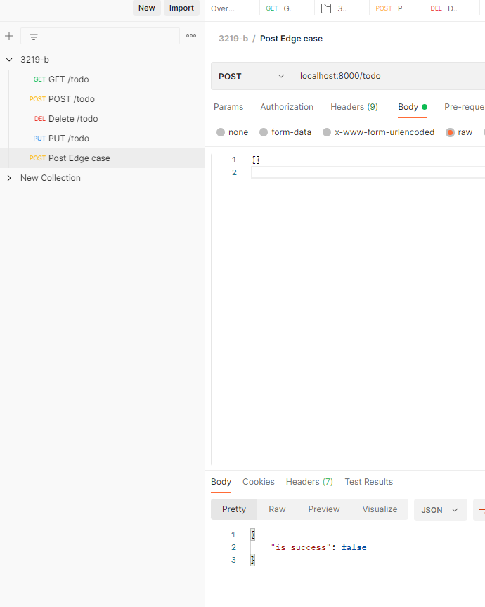
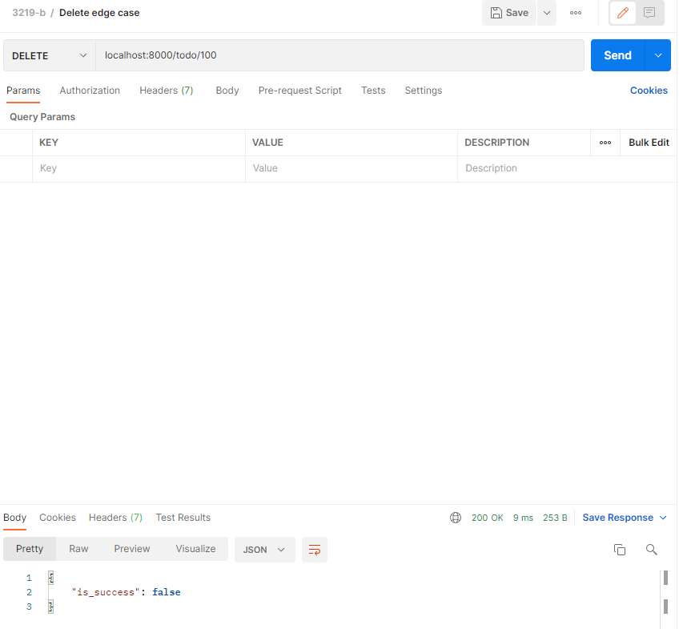
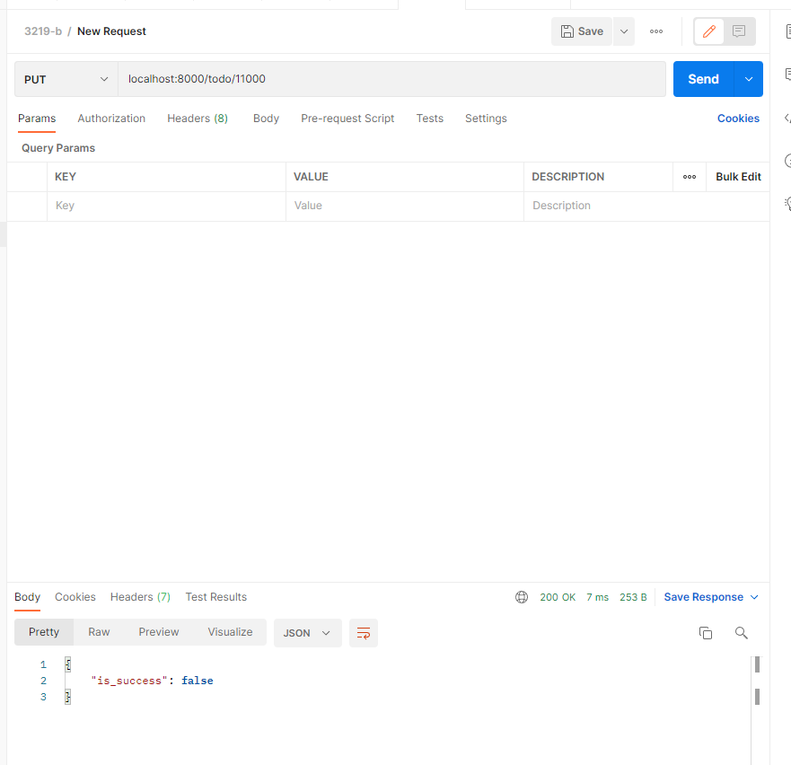

# CS3219-B1 & B2

# Student Name
Wen Junhua

# Student Number
A0196683L

# Github Link
https://github.com/Jh123x/CS3219-B

# Quick start guide
1. Install the requirements `pip install -r requirements.txt`
2. Change directory to webapp using `cd webapp`
3. Migrate the DB using `python manage.py migrate`
4. Run the server using `python manage.py runserver` to start the server

# API Endpoints
1. GET `/index` Sanity check that the website is online
2. GET `/todo` view all the Todo Items
3. POST `/todo` add the Todo Item to the list
4. PUT `/todo/{id}` mark the todo item as done
5. DELETE `todo/{id}` delete the todo item 

# Running tests locally
1. Go into the folder with `cd webapp`
2. Run `python manage.py test` to run the tests

# Running the test on CI
1. Push to the repo
2. Github actions run and the test will be executed within the actions

# Postman test cases

## Normal cases
1. Get request

2. Post request

3. Put request

4. Delete request

## Edge cases
1. Post empty body

1. Invalid delete id

1. Invalid put id

# Tech Stack
1. Django
