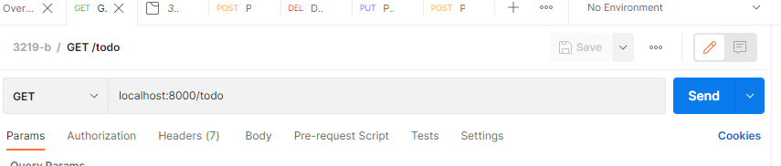
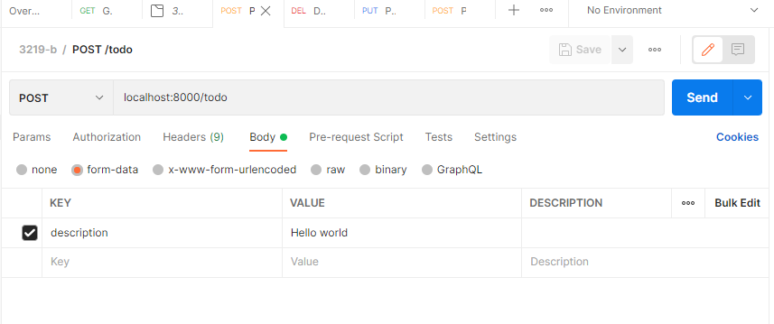
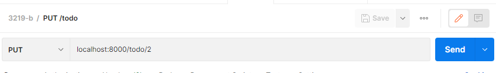
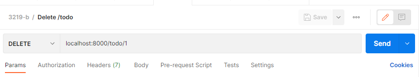
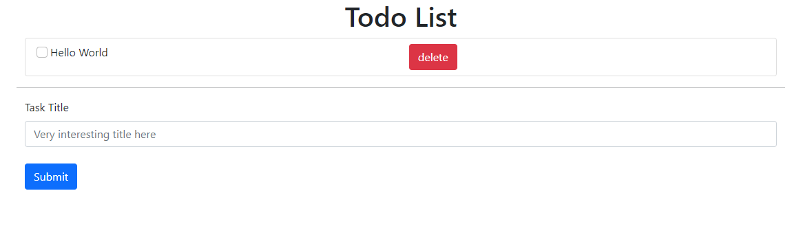

# CS3219-B4

# Student Name
Wen Junhua

# Student Number
A0196683L

# Github Link
https://github.com/Jh123x/CS3219-B

# Backend 
## Quick start guide
1. Install the requirements `pip install -r requirements.txt`
2. Change directory to webapp using `cd webapp`
3. Migrate the DB using `python manage.py migrate`
4. Run the server using `python manage.py runserver` to start the server

## Normal cases
1. Get request

2. Post request

3. Put request

4. Delete request

## API Endpoints
1. GET `/index` Sanity check that the website is online
2. GET `/todo` view all the Todo Items
3. POST `/todo` add the Todo Item to the list
4. PUT `/todo/{id}` mark the todo item as done
5. DELETE `todo/{id}` delete the todo item 

# Running tests locally
1. Go into the folder with `cd webapp`
2. Run `python manage.py test` to run the tests

# Running the test on CI
1. Push to the repo
2. Github actions run and the test will be executed within the actions

## Tech Stack
1. Django

# Front end

## Requirements
1. Make sure the backend code is running first

## Quick Start Guide
1. Change directory to the frontend folder using `cd frontend`
2. Install dependencies using `npm i`
3. Start the development server using `npm start`
4. The frontend should be running at [`localhost:3000`](http://localhost:3000)

## Styling
Styling is done using [bootstrap](https://getbootstrap.com/docs/5.1/getting-started/introduction/)

## Walk through
After going to localhost you should see something like this

To retrieve the todo tasks, it requires a statement to the api using `get` method

The inputs at the bottom allows the user to submit new tasks to the todo list. This makes use of the `post` method to send the todo to the endpoint.

When the checkbox is clicked, it updates the todo item by making a `put` request to update the status of the task.

When the delete button is pressed, it sends a `delete` request to the endpoint.

## Tech Stack
1. React
2. Axios
3. Bootstrap